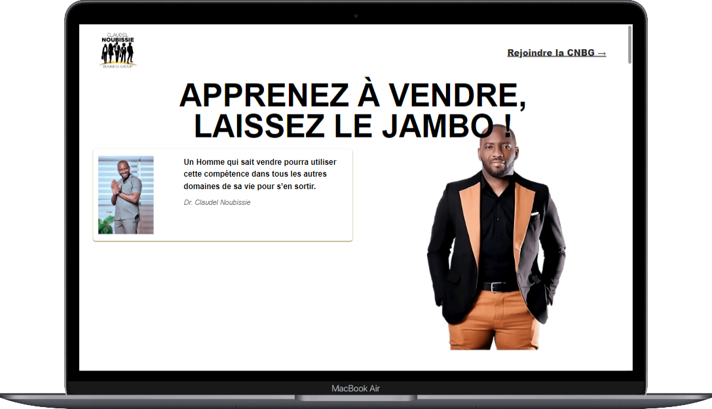

# Landing Page | Claudel Noubissie Business Group

## Table des matières

- [Aperçu](#aperçu)
- [Fonctionnalités](#fonctionnalités)
- [Technologies](#technologies)
- [Installation](#installation)
- [Utilisation](#utilisation)
- [Structure du projet](#structure-du-projet)
- [Contributions](#contributions)
- [Licence](#licence)

## Aperçu

Il s'agit d'une simple d'une landing page basé sur une publication du Dr. Docteur Noubissie parlant la Claudel Noubissie Business Group. Cette page présente la Claudel Noubissie Business Group avec la publication du docteur "APPRENEZ À VENDRE, LAISSEZ LE JAMBO !" Ce projet fait partie d'une série de 40 projets de développement web visant à pratiquer et améliorer les compétences en développement we que vous trouverez ici: [40 Projets de développement web](https://www.github.com/OumarouSandaSouley/40-Projets-de-Developpemetn-Web.git)

## Technologies

Ce projet utilise les technologies suivantes :

- **HTML5** : Structure de l'application.
- **CSS3** : Style et mise en page de l'application.
- **React JS** 
- **Tailwind CSS**

## Installation

Pour exécuter ce projet en local, suivez ces étapes :

1. Clonez le dépôt :
2. Accédez au répertoire du projet :
3. Exectuer dans le terminal `npm install` pour installer les dependances nécessaires du projet.
4. Enfin, executez `npm run dev` pour lancer le projet

## Caractéristiques de la page

- Design qualitatif
- Images d'illustration
- Responsive Design
- Calls to action
- Hight rates conversions...

## Contributions

Les contributions sont les bienvenues ! Si vous souhaitez améliorer ce Jeu ou ajouter de nouvelles fonctionnalités, n'hésitez pas à soumettre une pull request ou à ouvrir une issue.

1. Forkez le dépôt
2. Créez votre branche de fonctionnalité (`git checkout -b feature/ma-fonctionnalité`)
3. Validez vos modifications (`git commit -m 'Ajout de ma fonctionnalité'`)
4. Poussez sur la branche (`git push origin feature/ma-fonctionnalité`)
5. Ouvrez une pull request

## Licence

Ce projet est sous licence MIT. Consultez le fichier [LICENSE](LICENSE) pour plus de détails.
